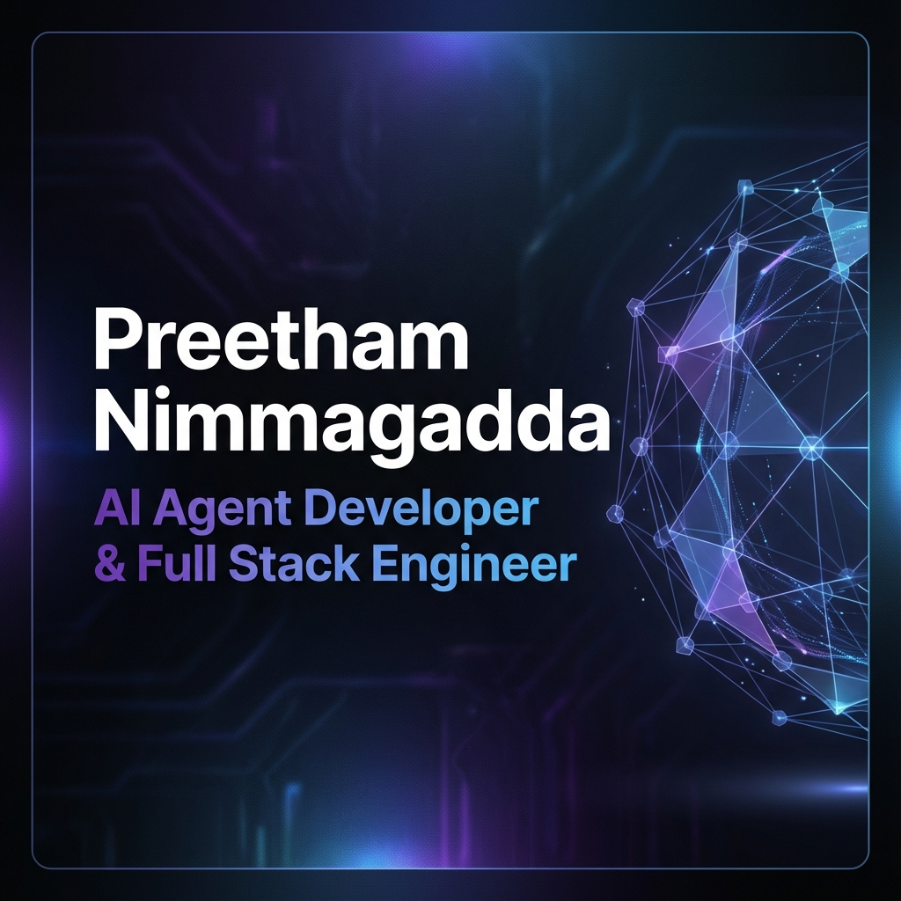

# Preetham Nimmagadda | Modern AI & Full Stack Portfolio

[](https://preethamnimmagaddaportfolio.web.app)

A high-performance, interactive, and mobile-responsive portfolio website built with the latest web technologies. This project showcases my work as an AI Agent Developer and Full Stack Engineer.



## 🚀 Key Features

- **Modern UI/UX:** Built with a "dark mode" first aesthetic, glassmorphism effects, and smooth transitions.
- **Interactive Animations:** Powered by `framer-motion` for complex scroll animations, floating elements, and parallax effects.
- **3D Elements:** Integrated `three.js` and `@react-three/fiber` for immersive 3D experiences.
- **Progressive Web App (PWA):** Fully installable as a native-like app on mobile and desktop devices.
- **Responsive Design:** Mobile-first approach ensuring a seamless experience across all screen sizes.
- **Performance Optimized:** Server-side rendered with Next.js 16 for blazing fast load times and SEO.

## 🛠️ Tech Stack

- **Framework:** [Next.js 16](https://nextjs.org/) (App Router)
- **Language:** [TypeScript](https://www.typescriptlang.org/)
- **Styling:** [Tailwind CSS 4](https://tailwindcss.com/)
- **Animations:** [Framer Motion](https://www.framer.com/motion/)
- **Icons:** [Lucide React](https://lucide.dev/)
- **3D:** [Three.js](https://threejs.org/) & [React Three Fiber](https://docs.pmnd.rs/react-three-fiber)
- **PWA:** [next-pwa](https://www.npmjs.com/package/next-pwa)
- **Deployment:** Firebase Hosting

## 📦 Getting Started

### Prerequisites

- Node.js 18.17 or later
- npm, yarn, pnpm, or bun

### Installation

1. **Clone the repository:**
   ```bash
   git clone https://github.com/PreethamNimmagadda02/portfolio.git
   cd portfolio
   ```

2. **Install dependencies:**
   ```bash
   npm install
   ```

3. **Run the development server:**
   ```bash
   npm run dev
   ```
   *Note: PWA features are disabled in development mode to prevent caching issues.*

4. **Open your browser:**
   Navigate to [http://localhost:3000](http://localhost:3000)

## 🏗️ Building for Production

To create a production build with full PWA support:

```bash
npm run build
npm start
```

## 📱 PWA Features

This portfolio is a certified Progressive Web App. It allows users to:
- Install the website as an app on iOS and Android.
- Launch from the home screen with a custom splash screen.
- Experience an app-like standalone interface without browser bars.

---

Designed & Built by **Preetham Nimmagadda**
